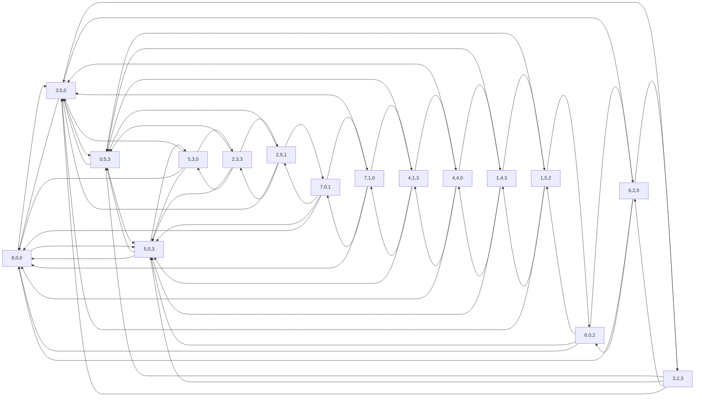

### 第一周作业

1. 求有 $n$ 个顶点, $m$ 条边的简单图个数.

解:总共可能的边数为 $\frac{1}{2}n(n-1)$ ,则在其中选择 $m$ 条边的方案数(即图总数)为 $C_{\frac{1}{2}n(n-1)}^m$ .

2. 证明:在 9 座工厂之间,不可能每座工厂都只与其他 3 座工厂有业务联系,也不可能只有 4 座工厂与偶数个工厂有业务联系.

解:若每座工厂都只与其他 3 座工厂有业务联系,则将其看作无向图总度数为 $9\times3=27$ 为奇数,与无向图总度数为偶数矛盾,故不可能存在. 若只有 4 座工厂与偶数个工厂有业务联系,则总度数为 $\sum_{i=1}^{4}(2k_i)+\sum_{i=1}^{5}(2l_i+1)$, 在 $k_i,l_i\in \N$ 下总度数必为奇数,同样矛盾不可能存在. 

3. 设 $G$ 是至少含有 2 个顶点的简单图,证明 $G$ 中至少有 2 个顶点度数相同.

解:由 $G$ 是简单图知 $G$ 的顶点度数取值范围是 $\{k|k\in \N\cap[0,n)\}$ ,其中 $n$ 是图顶点数,由此可知总共只有 $n$ 取值,其中 0 和 $n-1$ 的度不能出现在同一张图中,则总共 $n$ 个顶点选择 $n-1$ 种度数取值,有抽屉原理知肯定至少存在 2 个顶点度数相同.

4. 简单图 $G$ (有 $n$ 个顶点, $m$ 条边) 中,如果 $m>\frac{1}{2}(n-1)(n-2)$ ,证明 $G$ 不存在孤立顶点.

解:若 $G$ 存在孤立顶点,则将其去除得到 $n-1$ 个顶点 $m$ 条边的生成子图,生成子图仍为简单图,其边数最大值为 $\frac{1}{2}(n-1)(n-2)<m$ ,矛盾,故 $G$ 不存在孤立顶点.

8. 3 个量杯的容量分别是 8 升, 5 升和 3 升,现 8 升的量杯装满了水,问怎样才能把水分成 2 个 4 升,画出相应的图.

解:所有可能的情况及他们之间的转换关系如下(由 python 生成图源代码),由图可知一种可能的倒水方案是 $(8,0,0)\rightarrow(5,0,3)\rightarrow(5,3,0)\rightarrow(2,3,3)\rightarrow(2,5,1)\rightarrow(7,0,1)\rightarrow(4,1,3)\rightarrow(4,4,0)$ 

