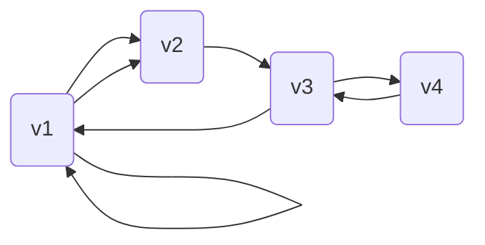

### 第二周作业

#### 习题 2

1. 设简单图 $G$ 有 $k$ 个联通支,证明:
$$\begin{align*}
m\le \frac{1}{2}(n-k+1)(n-k)
\end{align*}$$
    证明:构造具有 $n-k+1$ 个点的完全图,可知其边数恰为 $\frac{1}{2}(n-k+1)(n-k)$ 且连同剩下 $k-1$ 个点恰好有 $k$ 个联通支,若再增加任意一条边,由完全图的性质知该边至少连接一个不在所构造完全图内的点,即减少图中联通支的数目.且任意对边的修改都会造成联通支数量的减少,故 $\frac{1}{2}(n-k+1)(n-k)$ 即为图最大边数.
 

2. 证明: $G$ 和 $\overline{G}$ 至少有一个是连通图.
    \
    证明:假设 $G$ 是非联通图,则由定义知可以将 $G$ 的顶点分为两个非空集合 $N_{1},N_{2}$ ,不在同一个集合内的节点之间没有边相连,则在 $\overline{G}$ 中 $N_{1},N_{2}$ 满足 $\forall a\in N_{1},b\in N_{2},\exist e\in E$ 连接 $a,b$, 则显然任意的节点可以经过一条边(连接 $N_{1},N_{2}$ )或两条边(以另一个集合中的点作为中转)到达任意一个节点,故 $\overline{G}$ 为连通图. 由对称性质知 $G,\overline{G}$ 必有一个连通图.
 

5. 设 $G$ 是不存在三角形的简单图,证明:
    \
    (1) $\sum_{}^{}d^{2}(v_{i})\le mn$ 
    \
    解: 由 $G$ 中不存在三角形,知任意三个节点间至多存在两条边,使用归纳法, $n=1$ 时显然 $\sum_{}^{}d^{2}(v_{i})=0\le mn=0$ ,假设上式对于 $n$ 成立,则考虑添加一个新点,令其度数为 $k$ ,则对于新图 $\sum_{}^{}d_{1}^{2}(v_{i})=\sum_{}^{}d^{2}(v_{i})+2\sum_{}^{}d(v_{j})+k+k^{2}$ ,其中 $v_{j}$ 是与新点直接相连的点. 由图中不存在三角形, $v_{j}$ 之间不能有边连接,故原图的每条边至多连接(对应)一个 $v_{j}$ ,因此有 $\sum_{}^{}d(v_{j})\le m$ ,又 $k$ 个 $v_{j}$ 和 $n-k$ 个其他点之间至多有 $k(n-k)$ 条边,在 $v_{j}$ 上统计的度数至多为 $k(n-k)$ ,故 $\sum_{}^{}d(v_{j})\le k(n-k)$ ,使用上两式替换原不等式中的 $\sum_{}^{}d(v_{j})$ 得 $\sum_{}^{}d_{1}^{2}(v_{i})\le \sum_{}^{}d^{2}(v_{i})+m+k+kn\le mn+m+k+kn=(m+k)(n+1)$ 即为 $n+1$ 个点下的原式.由数学归纳法知原不等式成立.
    \
    (2) $m\le \frac{n^{2}}{4}$ 
    \
    解:由第一问知 $\sum_{}^{}d^{2}(v_{i})\le mn$ ,由柯西不等式得 $\sum_{}^{}d^{2}(v_{i})\ge \frac{1}{n}(\sum_{}^{}d(v_{i}))^{2}=\frac{4m^{2}}{n}$ ,即 $mn\ge \frac{4m^{2}}{n},m\le \frac{n^{2}}{4}$ 
 

7. 证明: 对无向简单图 $G$ ,若 $|E(G)|\ge |V(G)|$ ,则其一定存在一条回路.
    \
    证明:题意即 $m\ge n$ ,假设图不存在回路,选取图中边数减去点数最大的一个联通支,显然该联通支仍满足 $m\ge n$ (若否, $\forall i,m_{i}<n_{i}$ 直接推出 $m=\sum_{i}^{}m_{i}<\sum_{i}^{}n_{i}=n$ 矛盾),取该联通支内的任意一个点作为根节点,则由图中不存在回路知联通支内的其他点到该点存在唯一道路,将该唯一道路上的第一条边与该点对应,显然该对应是一个 $n_{i}-1$ 个点到 $n_{i}-1$ 条边的双射,还剩下至少 1 条边未对应,而此时联通支内的任意两点间已经存在道路(以根节点作为中转,去除重复道路即得到简单道路),多出来的边一定会与两点间已经存在的道路形成回路,故该联通支内一定存在回路.即原图中一定存在回路.
 

18. 设 $G$ 是 $n\ge 3$ 的简单图,证明:若
$$\begin{align*}
m\ge \frac{1}{2}(n-1)(n-2)+2
\end{align*}$$
则 $G$ 存在 $H$ 回路.
    \
    证明:试证 $G$ 中任意两节点 $v_{a},v_{b}$ 满足 $d(v_{a})+d(v_{b})\ge n-1$ ,若否,则由 $\sum_{i}^{}d(v_{i})=2m$ 知 $\sum_{i\ne a,i\ne b}^{}d(v_{i})>2m-n+1>(n-1)(n-2)+4-n+1=n^{2}-4n+7=(n-3)(n-2)+n+1$ ,即剩下的 $n-2$ 个节点至少有 $n+2$ 条向 $v_{a},v_{b}$ 的连边,这与 $d(v_{a})+d(v_{b})<n-1$ 矛盾,则原条件成立,可推出 $G$ 存在 $H$ 回路.
 

#### 选做题

19. 设 $G$ 是有向完全图,证明 $G$ 中存在有向的哈密顿道路.
    \
    证明:任意选取节点的一个排列 $v_{1},v_{2},\cdots,v_{n}$ ,由有向完全图的定义知 $\forall k\in \{1,2,\cdots,n-1\}$ ,存在有向边连接 $v_{k},v_{k+1}$ 且不重复,这些边及按该顺序连接的点就构成了 $G$ 中的一条有向哈密顿道路.
 

21. 设 $G$ 是有 $n$ 个顶点的简单图,其最小度 $\delta (G)\ge \frac{n+q}{2}$ ,证明 $G$ 中存在包含任意 $q$ 条互不相邻边的哈密顿回路
    \
    证明:任意选取 $q$ 条互不相邻的边,将其所连接的两个节点转化为一个节点,原来连接两节点的边全部连接到新节点上,去除重边后,新图节点数为 $n-q$ ,最小度 $\delta (G')\ge \frac{n-q}{2}$ 因为一个节点至多有 $q$ 条边因为重复而被删去,从而新图的任意两节点度之和 $\ge n-q-1$ ,由定理知新图存在哈密顿回路,将新节点变回原来的边连接的两个节点,则得到的新回路仍是哈密顿回路,从而原图存在包含该 $q$ 条边的哈密顿回路,上述边是任意选择的,故原命题也成立.
 

#### 练习题

有向图如图所示,求其中 $v_{1}$ 到 $v_{4}$ 长度为 1,2,3,4 的通路各是多少条?

显然 $v_{1}$ 到 $v_{4}$ 的最短距离为 3,故长度为 1,2 的所求通路有 0 条,最短路径为 $v_{1}\rightarrow v_{2}\rightarrow v_{3}\rightarrow v_{4}$ ,其中仅 $v_{1}$ 到 $v_{2}$ 有重边,故长度为 3 的所求通路有 2 条,长度为 4 的通路仅可以在最短路径基础上在 $v_{1}$ 增加一个自环路径,故也有 2 条.

使用标准矩阵乘法处理邻接矩阵幂也可以得到通路条数,原图邻接矩阵 $G=\begin{bmatrix}
    1   &   2   &   0   &   0\\ 
    0   &   0   &   1   &   0\\ 
    1   &   0   &   0   &   1\\ 
    0   &   0   &   1   &   0\\ 
\end{bmatrix}$ ,其中数字代表连接的边数,计算得到 $G^{2}=\begin{bmatrix}
    1   &   2   &   2   &   0\\ 
    1   &   0   &   0   &   1\\ 
    1   &   2   &   1   &   0\\ 
    1   &   0   &   0   &   1\\ 
\end{bmatrix}$ , $G^{3}=\begin{bmatrix}
    3   &   2   &   2   &   2\\ 
    1   &   2   &   1   &   0\\ 
    2   &   2   &   2   &   1\\ 
    1   &   2   &   1   &   0\\ 
\end{bmatrix}$ , $G^{4}=\begin{bmatrix}
    5   &   6   &   4   &   2\\ 
    2   &   2   &   2   &   1\\ 
    4   &   4   &   3   &   2\\ 
    2   &   2   &   2   &   1\\ 
\end{bmatrix}$ ,读取第一行第四列的值即为 $v_{1}$ 到 $v_{4}$ 给定长度通路的数量 0,0,2,2. 